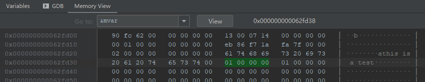
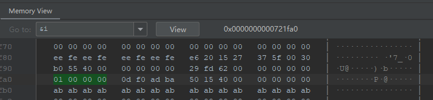
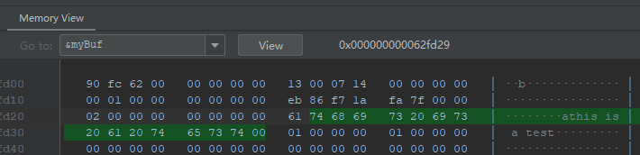
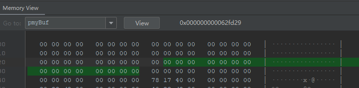

# 1.线程传参详解，detach()的大坑，成员函数做线程函数
## 传递临时对象作为线程参数
### (1)要避免的陷阱1
```c++
#include "iostream"
#include "vector"
#include "thread"


using namespace std;

void myPrint(const int &i, char *pmyBuf) {
    cout << i << endl;        //i实际并不是mvar的引用，实际是值传递。所以主线程用detach执行这个函数是安全的
    cout << pmyBuf << endl;   //指针在detach子线程时一定会有问题，所以在创建子线程不可以用指针(此时pmyBuf指向同一片内存)
    return;
}

int main() {
//1.传递临时对象作为线程参数
    int mvar = 1;
    int $myVar = mvar;
    char myBuf[] = "this is a test";
    thread myThreadObj(myPrint, mvar, myBuf);
//    myThreadObj.join();
    myThreadObj.detach();
    cout << "I Fuck America!" << endl;
}
```
对于变量mvar，debug过程中发现其地址为：[0x00...062fd38]
  
线程函数中，传入参数变量i的地址为：[0x00...0721fa0]
  
两者的地址并不相同，所以用detach的时候，并不存在主线程执行完毕，主线程变量被清除，
但是子线程还在访问同一片内存地址的不安全情况

对于变量myBuf的地址，debug过程中其地址为:[0x00...062fd29]
  
对于变量*pmyBuf的地址，debug过程中发现其地址为：[0x00...062fd29]
  
与myBuf的地址相同，所以存在主线程使用detach的时候，主线程完毕，变量被清除，子线程
还在访问同一片内存的不安全情况

### (2)要避免的陷阱2
将传入参数char * 换成 const string &pmyString
```c++
#include "iostream"
#include "vector"
#include "thread"


using namespace std;

void myPrint_2(const int &i, const string &pmyString) {
    cout << i << endl;
    cout << pmyString.c_str() << endl;   //此时&pmyString和&myBuf指向的内存地址是不一样的，所以主线程用detach是安全的
    return;
}

int main() {
    int mvar = 1;
    int &myVar = mvar;
    char myBuf[] = "this is a test";
    thread myThreadObj(myPrint_2, mvar, string(myBuf));
    myThreadObj.join();
    cout << "I Fuck America!" << endl;
    return 0;
}
```
此时debug可以发现myBuf的地址和pmyString的地址是不同的，说明此时不存在使用detach，
主线程执行完毕，子线程程序还在访问同一片内存的情况。
但是事实上存在一个情况，那就是主线程执行完毕，myBuf被回收，系统采用myBuf去转换
成string的可能性。所以传入的参数myBuf需要转换成string对象
举个类的例子：
```c++
#include "iostream"
#include "vector"
#include "thread"

using namespace std;

class A {
public:
    int m_i;
    A(int i): m_i(i) {
        cout << " A(int a) construct function" << endl;
    }
    A(const A &a): m_i(a.m_i) {
        cout << "A(const A) copy construct function" << endl;
    }
    ~A() {
        cout << "~A() deconstruct function" << endl;
    }
};

void myPrint3(const int &i, const A &pmyBuf) {
    cout << &pmyBuf << endl;
    return;
}

int main() {
    int mvar = 1;
    int mySecondpar = 12;
    thread myThreadObj(myPrint3, mvar, A(mySecondpar)); //mySecondpar进行类型转化A(mySecondpar)就可以确保实现正常构造和输出
//    myThreadObj.join();
    myThreadObj.detach();
    
    cout << "I Fuck America!" << endl;
    
    return 0;
}
```
此时上述程序用join()执行可以实现用mySecondpar这个整型变量实现类A的构造
换用detach()，此时发现不一定能实现类A的构造（有时可以，有时不行，去掉主线程的
输出就发现一定不可以，因为主线程结束的更早了，子线程来不及构造和析构）
此时将mySecondpar进行类型转化A(mySecondpar)就可以实现正常构造和输出
结论：在创建线程的同时构造临时对象是可行的，也是最安全的。

### (3)总结
* 若传递int这种简单类型参数，建议都是值传递，不要用引用
* 如果传递类对象，避免隐式类型转换。全部都在创建线程的时候构建临时对象，然后再函数参数里面用引用来接
* 能不用detach就不用，用join就好

# 2.临时对象作为线程参数
## （1）线程id的概念
id是个数字，每一个线程（不管是主线程还是子线程）实际上都对应一个数字，而且每一个线程
都对应一个独立的数字。线程id可以用std::this_thread::get_id()来获取。
## （2）临时对象构造实际捕获
```c++
//
// Created by Viets on 2021/6/28.
//
#include "iostream"
#include "vector"
#include "thread"


using namespace std;

class A {
public:
    int m_i;
    A(int i): m_i(i) {
        cout << " A(int a) construct function " << this <<" thread_id = " << std::this_thread::get_id() << endl;
    }
    A(const A &a): m_i(a.m_i) {
        cout << "A(const A) copy construct function " << this <<" thread_id = " << std::this_thread::get_id() << endl;
    }
    ~A() {
        cout << "~A() deconstruct function " << this <<" thread_id = " << std::this_thread::get_id() << endl;
    }
};


void myPrint(const A &pmyBuf) {
    cout << "sub_thread_var_addr:" << &pmyBuf << " threadId=" << std::this_thread::get_id() << endl;
    return;
}


int main() {
    cout << "main thread id = " << std::this_thread::get_id() << endl;
    int mvar = 1;
    std::thread myThreadObj(myPrint, A(mvar));
    myThreadObj.join();
    return 0;
}
```
可以发现，上述程序用了临时对象之后类是在主线程中构造的

# 3.传递类对象，智能指针作为线程参数
```c++
#include "iostream"
#include "vector"
#include "thread"

using namespace std;

class A {
public:
    mutable int m_i;
    A(int i): m_i(i) {
        cout << " A(int a) construct function " << this <<" thread_id = " << std::this_thread::get_id() << endl;
    }
    A(const A &a): m_i(a.m_i) {
        cout << "A(const A) copy construct function " << this <<" thread_id = " << std::this_thread::get_id() << endl;
    }
    ~A() {
        cout << "~A() deconstruct function " << this <<" thread_id = " << std::this_thread::get_id() << endl;
    }
};


void myPrint2(const A &pmyBuf) {
    pmyBuf.m_i = 199;  //我们修改这个值不会影响main函数
    cout << "sub_thread_var_addr:" << &pmyBuf << " threadId=" << std::this_thread::get_id() << endl;
    return;
}


int main() {
    cout << "main thread id = " << std::this_thread::get_id() << endl;
    A myAobj(10);
    std::thread myThreadObj(myPrint2, std::ref(myAobj)); //将类对象作为线程参
    myThreadObj.join();

    return 0;
}
```
使用std::ref，类对象直接传入线程参数，不会进行拷贝。所以最后主线程对象和子线程对象地址相同


